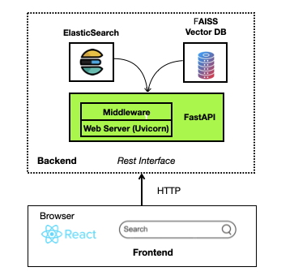

# News Articles Search Engine

This repository contains a powerful news search engine that enables users to discover relevant news articles based on search queries. Key features include:

* **Intelligent Search** – Find news articles matching your query with high accuracy.

* **Similarity Detection** – Identify articles most similar to those selected by the user.

* **Novelty Analysis** – Evaluate how unique a news article is compared to all previously published articles.

 Optimized for speed, relevance, and insightful analysis!


## Solution
We have developed a user-friendly interface using **React** (frontend) and **FastAPI** (backend) that enables users to submit queries and retrieve relevant news articles efficiently.


A high level diagram of the architecture is described below:

<div align="center">
  
</div>

## Searching Approach

### Data
First, we load the news articles data used in the following article: 

[Practical Solutions to the Problem of Diagonal Dominance in Kernel Document Clustering](https://publications.scss.tcd.ie/tech-reports/reports.06/TCD-CS-2006-04.pdf) 

[BBC News Dataset](http://mlg.ucd.ie/datasets/bbc.html) 

To download these articles, run the [`data_loader.py`](data/data_loader.py) script.


 

### Searching Algorithm

Our solution is based on a hybrid search approach, combining both sparse and dense retrievers. The Sparse retriever uses `ElasticSearch` to run the search query against all articles, identifying co-existing keywords and phrases between the search query and documents. The higher the number of hits (number of co-existing keywords/phrases between query and the articles), the higher the score returned by the sparse retriever, indicating that the documents are potentially relevant to the search query.

The dense retriever leverages embeddings extracted by a pre-trained transformer [sentence-transformers/nli-bert-large-max-pooling](https://huggingface.co/sentence-transformers/nli-bert-large-max-pooling). This transformer generates embeddings for both the search query and each article. By calculating the cosine similairity score between the search query embedding and the embeddings of each article, we can identify documents that are semantically similar to the search query. A higher similarity score indicates a greater likelihood that the document is relevant to the search query.

The ranking results from the sparse and dense retriever are combined using the `Reciprocal Rank Fusion (RRF)` score. RRF ranks each article based on its position in both the sparse and dense retrieval rankings and then merges these rankings to produce a unified result list. The RRF score is calculated by summing the inverse rankings from each list, effectively integrating both retrieval approaches to enhance the relevance of the final results.

## Install packages

Python 3.11.8 was used to develop the search engine. Please follow the next steps to run the search approach:
* Step 1: Install ElasticSearch on you local machine. Download and 
install the pre-built packages based on the operating systems: https://www.elastic.co/downloads/past-releases/elasticsearch-7-17-9 
<br>
<br>
* Step 2: Once ElasticSearch is downloaded and unzipped, run the binary of it, here:

  ``` elasticsearch-7.17.9/bin/elasticsearch```

  When ElasticSearch is up and running successfully we will see the following in our terminal:
   ``` [2024-07-17T12:12:31,856][INFO ][o.e.h.AbstractHttpServerTransport] [Pet-Pav-Mac-Air.local] publish_address {127.0.0.1:9200}, bound_addresses {[::1]:9200}, {127.0.0.1:9200}```
<br>
<br>
* Step 3: Make sure the host and port (here, `port=9200` and `host=localhost`) is configured correctly in  [`sparse_retrieval_code.py`](app/sparse_retrieval_code.py)
<br>
<br>
* Step 4: Navigate to [code](app) and install all the python packages by running the following command in terminal:
  ```sh
  pip install -r requirements.txt  
  ```
* Step5: Install the Spacy model `en_core_web_sm` by running the following python command on terminal: 
  ```sh  
  python -m spacy download en_core_web_sm
  ```


## Generate Data

To generate the data for the application:

1) Run script [`data_loader.py`](data/data_loader.py) to download the [`bbc news dataset`](http://mlg.ucd.ie/datasets/bbc.html)
2) Run Script [`data_initiation.py`](data/data_initiation.py) to load the text data into our sparse and dense retrievers.


## Run the Application

### Run the Backend

Navigate to the [app](app) directory and start the backend by running: 

```sh
python main_app.py
```

### Run the Front End App

Navigate to the [frontend](frontend) directory and run the following commands:

1. Install the dependencies (in not already installed):
```shel 
npm install
```


2. Start the Development Server:

```sh   
npm run dev
```
